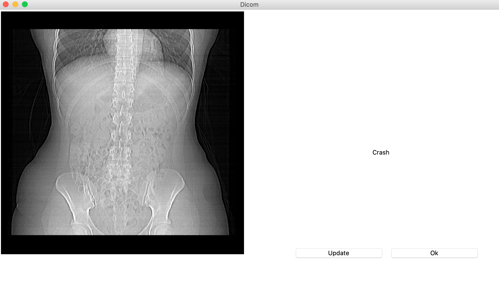
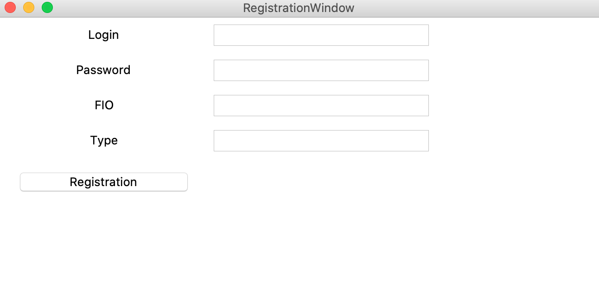
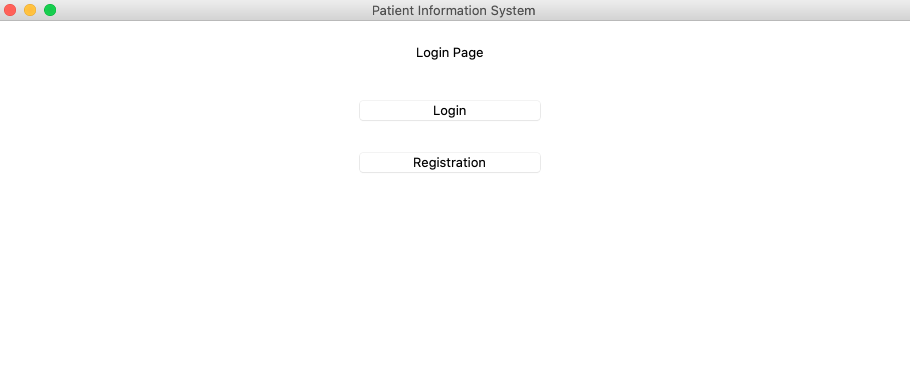
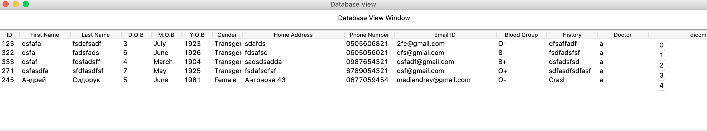
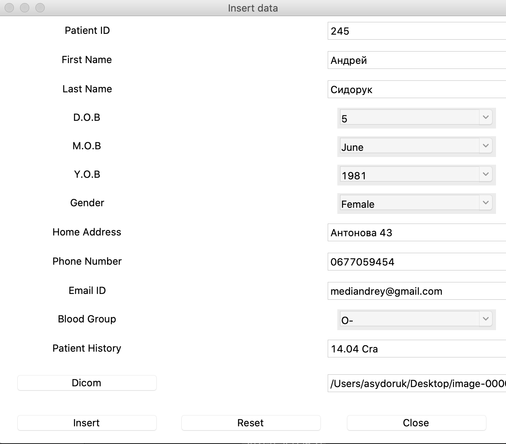
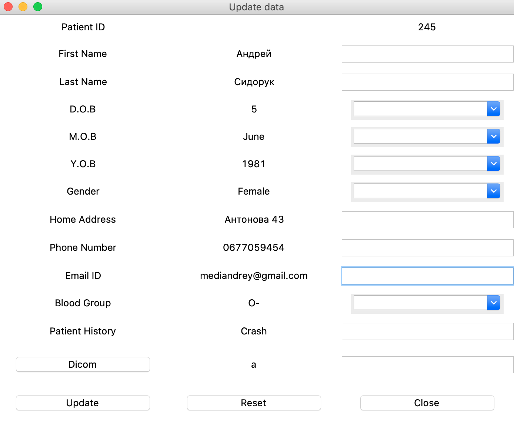
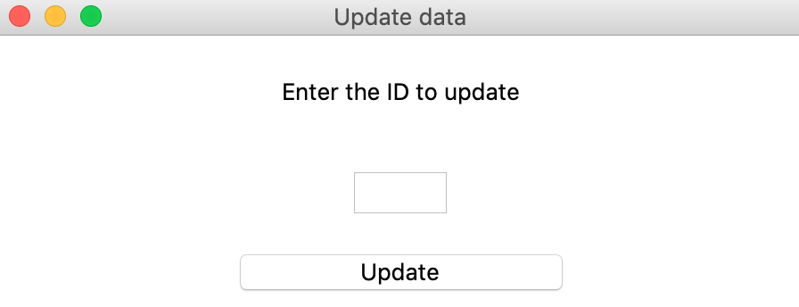

# PyMedSystem
Patient monitoring software
### Implementation:
Tkinter,SQLite3,Pydicom,PIL,numpy
### How To Setup
1. Clone This Project `git clone`
2. Go to Project Directory `cd pymedsystem`
3. Create a Virtual Environment `python3 -m venv env`
4. Activate Virtual Environment `source env/bin/activate`
5. Install Requirements Package `pip install -r requirements.txt`
6. Run `python patient-information-system.py`
### View

